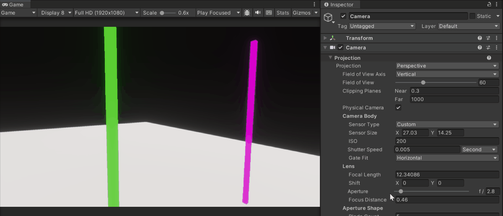
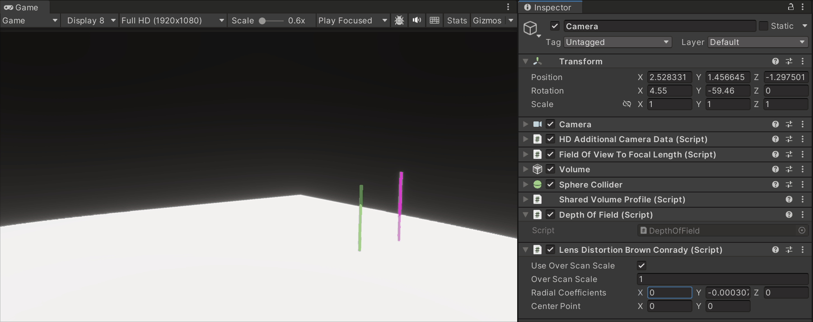
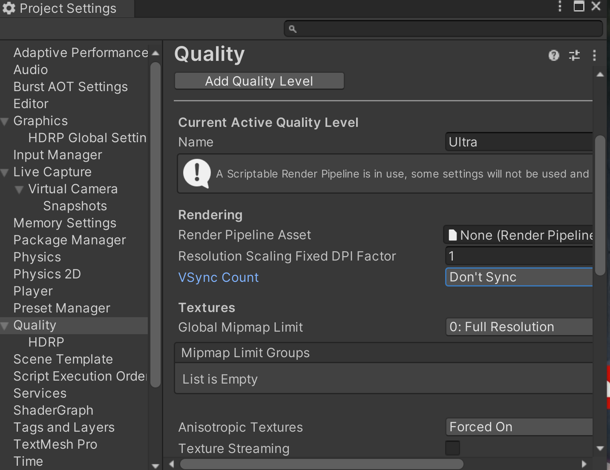
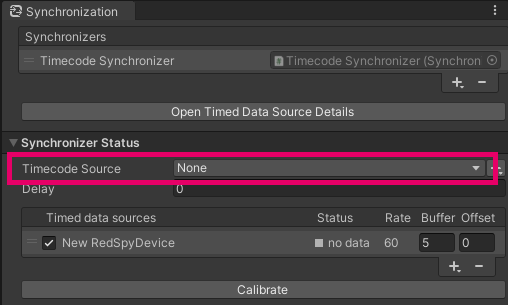
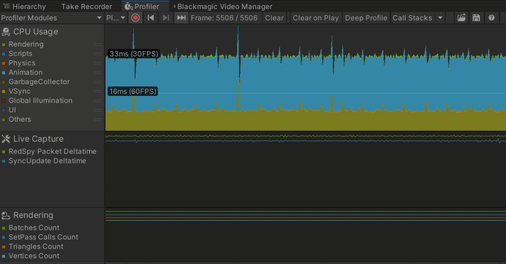

# Features

Get an overview of the stYpe package features and further set up your Unity environment to improve time and frame accuracy.

| Section | Description |
|---|---|
| [Components](#components) | Get a description of all properties of the components provided in the stYpe package. |
| [Post-effects](#post-effects) | Get an overview of the camera post-effects you can control from your stYpe device. |
| [External Synchronization](#external-synchronization) | Set up genlock and timecode synchronization for your stYpe device in Unity. |
| [Profiling](#profiling) | Set up a Profiler Module in Unity to identify potential frame rate issues that would occur despite synchronization. |

## Components

This package provides a **RedSpy Device** component to sync the RedSpy device and the virtual camera in Unity scene.

### RedSpy Device component

This is the core component that defines a GameObject as a Capture Device through which you can drive a Unity Camera from a stYpe RedSpy device. You can access its properties either from the Take Recorder window or from the Inspector of the Capture Device GameObject.

Properties for setup:

|Item |Description |
|---|---|
| **Camera** | The Unity camera to drive from your the stYpe device. |
| **Timecode Source** | The timecode source to use for the device timecode. If leave the selection to **None**, Unity uses the timecode in frames received from the stYpe device. |
| **Frame Rate** | The number of frames per second received from the stYpe device. |

All the other properties represent the data obtained by parsing the frames received from the stYpe device. All this data is reflected in the Unity camera properties, resulting in animating the camera in the Scene. You can check these properties to verify that the device is configured correctly.

## Post Effects

The RedSpy device allows you to control the following camera post-effects:

- Depth Of Field
- Lens Distortion

**Note:** Post-effects are not configured by default when you set up a Capture Device.

### Setup

To set up the targeted Camera for supporting post-effects according to your stYpe device:

1. Open the **Take Recorder window** and access the properties of the RedSpy Capture Device you've set up.

   If you see a warning message under the selected Camera, it means it is not yet configured to support post-effects.

2. Click the **Fix button**.

   This automatically adds the necessary components for the post-effects to the camera object.

### Depth Of Field

Apply Depth Of Field in Unity at the same time as compositing the actual image to a blurry image effect.

This package supports Depth Of Field in the following rendering pipelines:

- **HDRP 14.0 or later**
- **URP 14.0 or later**

### Lens Distortion

Apply Lens Distortion to reduce errors around the image that occur when merging with the actual image.

The stYpe package uses the Brown-Conrady lens distortion model.

This package supports Lens Distortion in the following render pipelines:

- **HDRP 14.0 or later**

## External Synchronization

A slight discrepancy always exists between the 3D rendering image in Unity and the real camera image. To resolve this discrepancy, it's necessary to synchronize the signal coming from the stYpe device with the video. You can connect stYpe devices and timecode generators to get time and frame synchronization within Unity.

Check the Live Capture package documentation about [Genlock](https://docs.unity3d.com/Packages/com.unity.live-capture@4.0/manual/genlock.html).

**Note:** Currently, external sync via Genlock is only supported on Blackmagic capture boards.

1. Set **VSync Count** in the Quality Settings:

   a. Select **Editor** > **Project Settings** from the menu and open the **Quality** section.

   b. Under **VSync Count**, select **Don't Sync**.

   

2. Set **Genlock Source** in the Live Capture Project Settings:

   a. Select **Live Capture** section in the Project Settings Window.

   b. Change **Genlock Source** to **Blackmagic**.

   c. Set the **Frame Rate** and make sure it matches the fps value set in the RedSpy device.

   

3. Configure the RedSpy device in the [Synchronization window](https://docs.unity3d.com/Packages/com.unity.live-capture@4.0/manual/ref-window-synchronization.html).

   The timing of the video is aligned with the data stream coming from the RedSpy device.

4. Select the Input Device as the **Timecode Source**.

   

5. If there is a delay on the CG side, set the value to the **Offset** on the RedSpy device side to adjust the delay.

   

## Profiling

If the frame rate is not stable even with synchronization settings, the following profiling tools may help identify the cause of the problem.

### Set up a Profiling Module

**Note:** Live Capture's profiling tools rely on the **Unity Profiling Core API** package. Check the Package Manager Window to make sure this package is installed.

1. Add a new module in the [Profiler Module Editor window](https://docs.unity3d.com/Manual/profiler-module-editor.html).

2. Set up a counter for that module by selecting it from the **User** > **Scripts** category.

### Profiler Counter for Live Capture

The following counters are available:

| Counter name | Description |
| --- | --- |
| **RedSpy Packet Deltatime** | If this counter is inconsistent, the network bandwidth may be unstable. |
| **SyncUpdate Deltatime** | If this counter is inconsistent, CPU load may be unstable. |

If the frame rate is stable, the counter maintains a constant value. If the counter value isn't constant, the output results may be negatively affected. Check the [Troubleshooting](troubleshooting.md) section for possible solutions.
