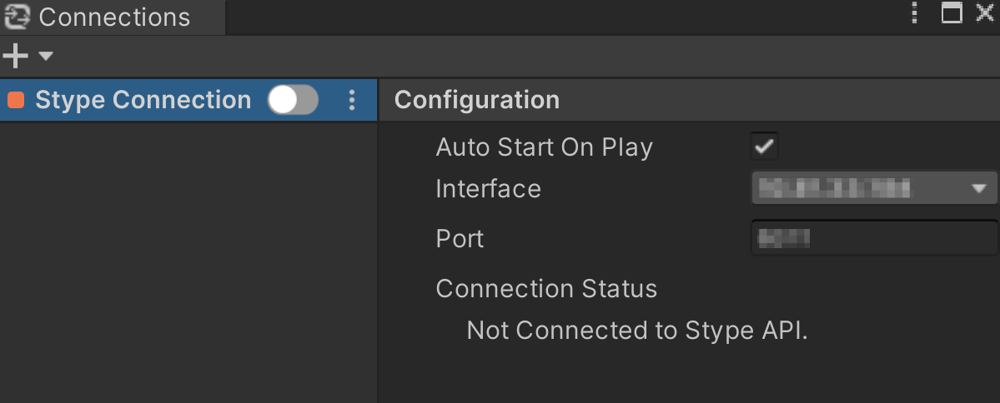
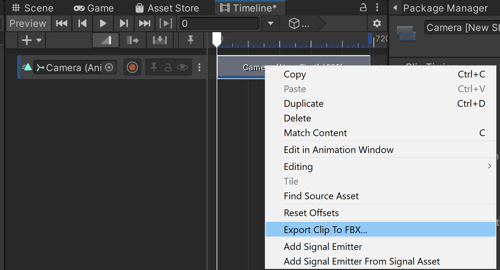

# Get started

Set up your stYpe RedSpy device and connect it to the Unity Editor to control a camera in your Unity Scene.

Before you start, make sure to [**setup your local network**](https://docs.unity3d.com/Packages/com.unity.live-capture@4.0/manual/connection-network.html) according to the Live Capture package requirements.

## Set up your stYpe device

### Requirements

* The stYpe device is powered on.
* The device firmware is updated to the latest version.
* Lens calibration is complete.

### RedSpy device Setup

1. Set **Protocol** to **StypeHF**.

2. Set **Zoom Polarity** to **Inverted**.

3. Set **Focus Polarity** to **Normal**.

4. Make sure **IP address** and **port number** are set to proper values for network connection.

5. In the lens calibration settings, set **DOF mode** to **ON** .

## Connect the stYpe device to the Unity Editor

Use the [Connections window](https://docs.unity3d.com/Packages/com.unity.live-capture@4.0/manual/ref-window-connections.html) to create and enable a connection between your stYpe device and the Unity Editor:

1. From the Unity Editor menu, select **Window** > **Live Capture** > **Connections**.

2. Select the **+** (plus) button in the upper left corner and choose **stYpe Connection**.

3. Choose the IP address in **Interface** and set the **Port**.

4. Verify the Connection Status changes to **`Connected to stYpe API.`**.

## Create a Capture Device

Use the [Take Recorder window](https://docs.unity3d.com/Packages/com.unity.live-capture@4.0/manual/ref-window-take-recorder.html) to create a Capture Device that drives a Unity Camera using the data received from your stYpe device:

1. From the Unity Editor menu, select **Window** > **Live Capture** > **Take Recorder**, and then select the **+** (plus) button in the Capture Devices panel and choose **stYpe > RedSpy**.

2. Set the **Camera** property to target the camera of the Hierarchy you want to drive with your stYpe device.

3. Set the appropriate values to **Timecode Source** and **Framerate** to synchronize with the video.

4. Click the **Fix** button if a warning appears.

5. Click the **Live** button.

Your stYpe device now controls the targeted Unity camera in the Unity Scene.

## Record and export camera animation

You can record the Unity camera movements and property changes as **animation clips**, which you can then export as FBX files, if needed, for post-processing in 3DCG software other than Unity (subject to [FBX Exporter](https://docs.unity3d.com/Packages/com.unity.formats.fbx@latest) package installation).

### Take recording

Use the [Take Recorder window](https://docs.unity3d.com/Packages/com.unity.live-capture@4.0/manual/ref-window-take-recorder.html) to record takes through a Shot Library.

1. In the top left pane of the Take Recorder window, select **Shot Library**.

   

2. Select a Shot to record the take in.

3. Click the **Create Shot Library** button.

4. Click the **Record** button.

  

### FBX export

Use the [FBX Exporter](https://docs.unity3d.com/Packages/com.unity.formats.fbx@latest) package to export a recorded take to an FBX file:

In the Timeline window, right click the Take Recorder clip you have recorded and select **Export Clip To FBX...**.

