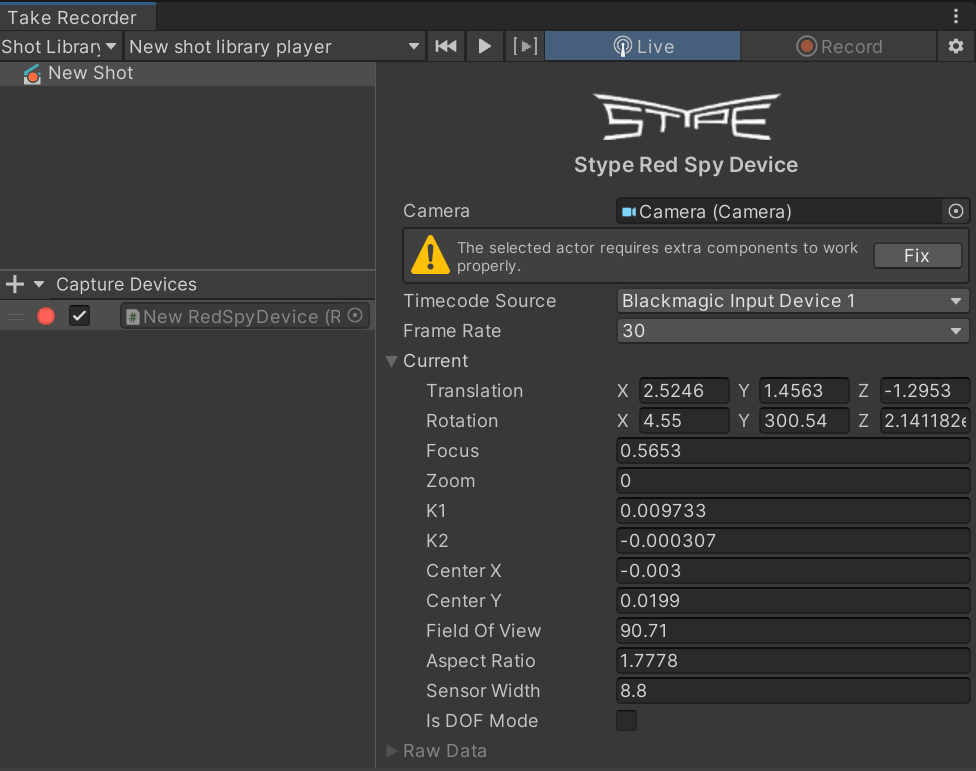
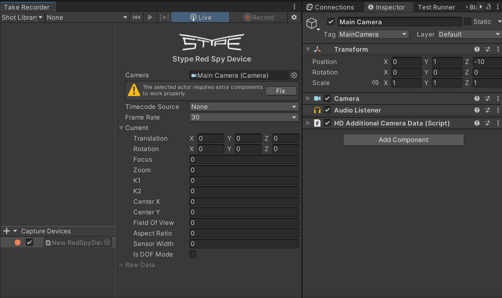
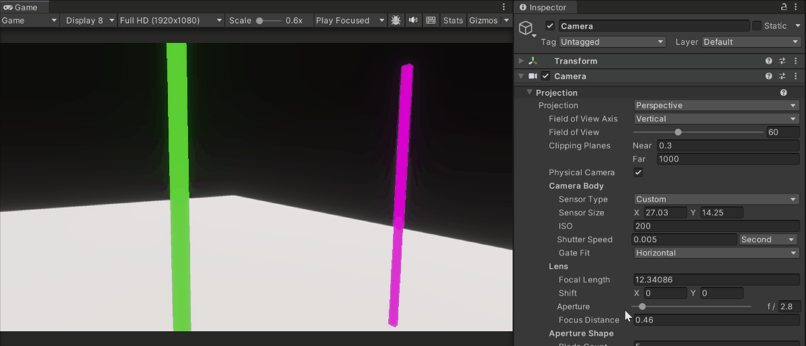
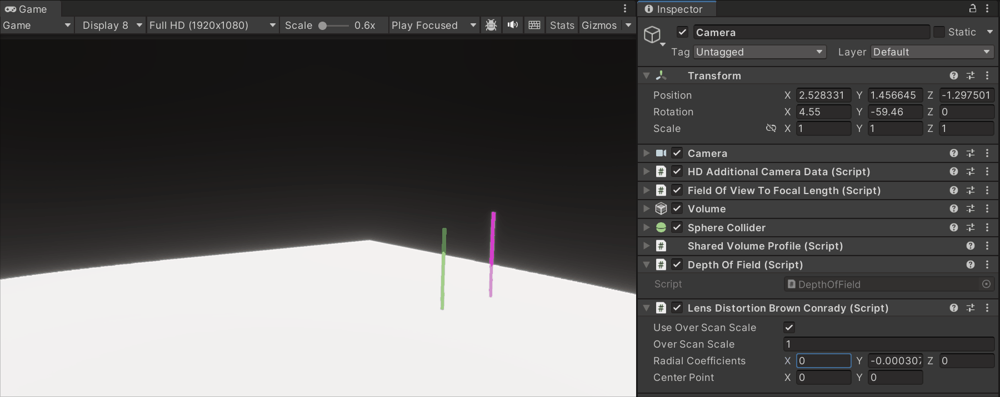
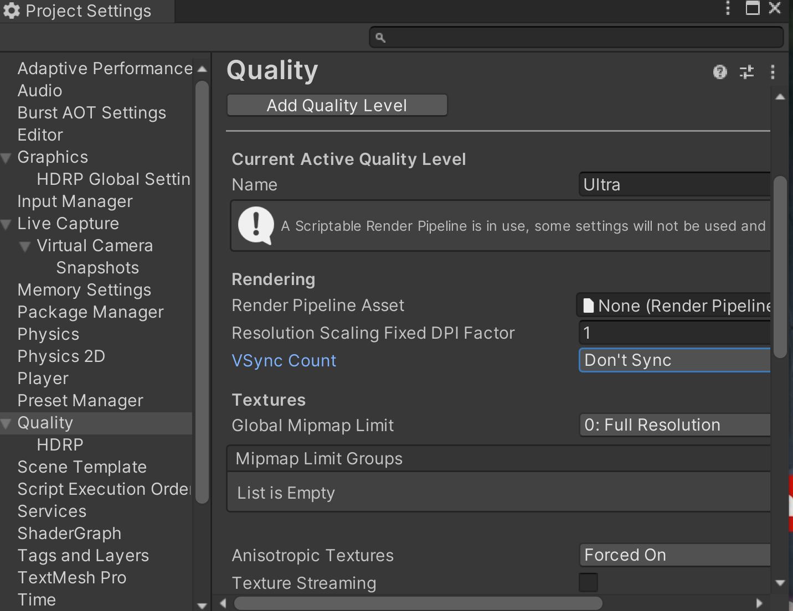
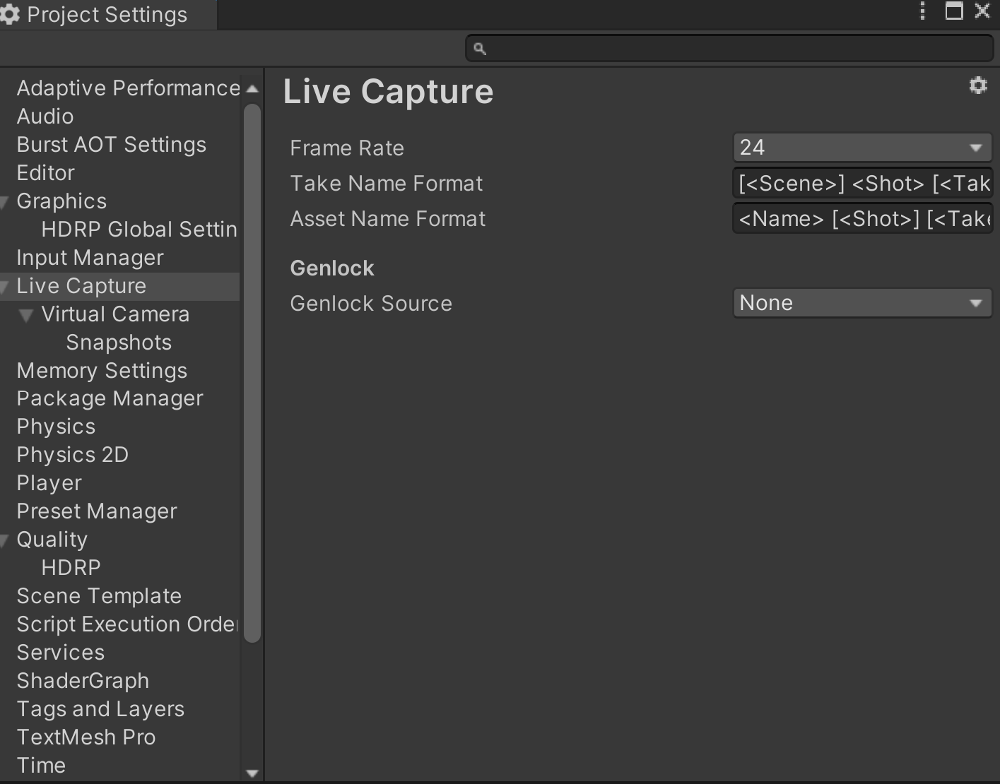
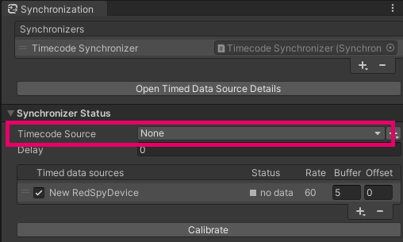
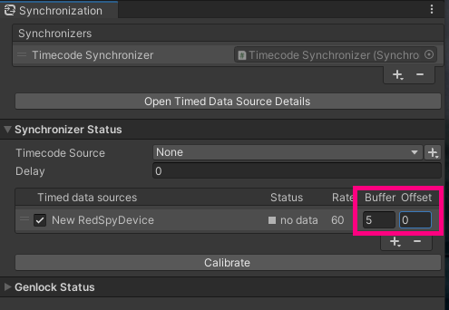
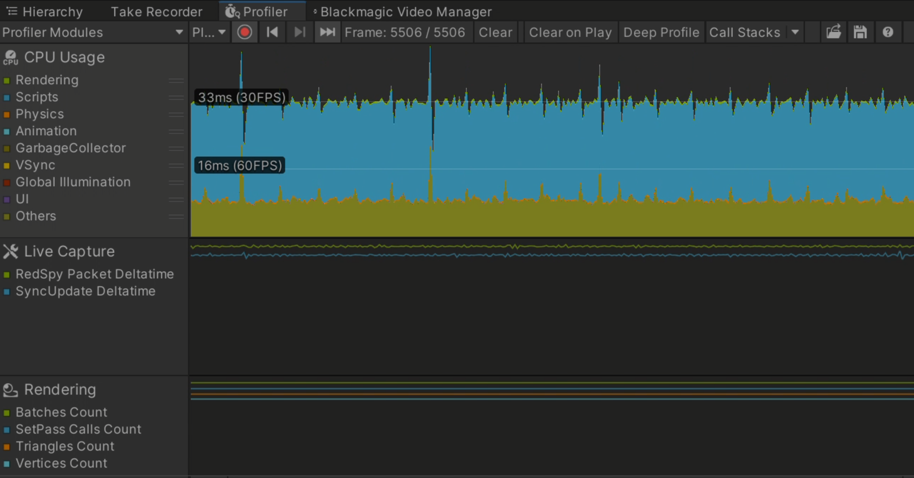
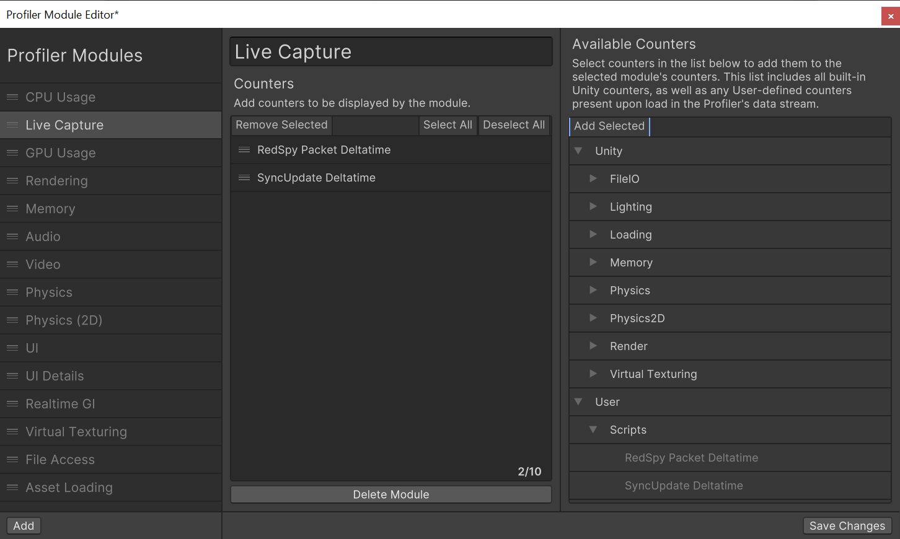

# 機能

Stype パッケージの機能の概要を理解し、Unity をセットアップすることで時間とフレームの精度を向上させます。

| 項目 | Description |
|---|---|
| [コンポーネント](#コンポーネント) | Stype パッケージで提供されているコンポーネントのプロパティについて説明します。 |
| [ポストエフェクト](#ポストエフェクト) | Stype デバイスからコントロールできるカメラのポストエフェクトについて説明します。 |
| [外部同期](#外部同期) | Unity で Stype デバイスの Genlock とタイムコード同期を設定します。 |
| [プロファイリング](#プロファイリング) | カメラと 3DCG が正しく同期しない場合に、Unity にプロファイラーモジュールを設定することで、原因の特定を簡単にします。 |

## コンポーネント

本パッケージは、RedSpy デバイスと Unity シーンの仮想カメラを同期するための **RedSpy Device** コンポーネントを提供します。

### RedSpy Device コンポーネント

これは GameObject をキャプチャデバイスとして定義するコアコンポーネントで、Stype RedSpy デバイスから Unity カメラを制御することができます。このコンポーネントのプロパティには、Take Recorder ウィンドウからアクセスするか、Capture Device の GameObject のインスペクタからアクセスすることができます。

セットアップ用のプロパティ:

| プロパティ | 説明 |
|---|---|
| **Camera** | Stype デバイスから制御する Unity カメラ。 |
| **Timecode Source** | デバイスのタイムコードに使用するタイムコードソースです。**None** を選択すると、Stype デバイスから受信したフレームのタイムコードを使用します。 |
| **Frame Rate** | Stype デバイスから受信する1秒あたりのフレーム数。 |

その他のプロパティはすべて、Stype デバイスから受信したフレームを解析して得られたデータを表します。これらのデータは全て Unity カメラのプロパティに反映され、シーンのカメラアニメーションに反映されます。これらのプロパティを確認することで、デバイスが正しく動作していることを確認できます。

## ポストエフェクト

RedSpy デバイスでは、以下のカメラのポストエフェクトを制御できます：

- 被写界深度
- レンズディストーション

**注意:** キャプチャデバイスを設定する際、ポストエフェクトはデフォルトでは設定されません。

### セットアップ

ポストエフェクトを行うカメラを Stype デバイスに応じて設定します：

1. **Take Recorder ウィンドウ**を開き、RedSpy キャプチャデバイスのプロパティにアクセスします。

   選択したカメラの下に警告メッセージが表示されている場合は、ポストエフェクトを行うための設定が正しく行われていないことを意味します。

2. **Fix ボタン**をクリックします。

   これにより、ポストエフェクトに必要なコンポーネントがカメラオブジェクトに自動的に追加されます。

### 被写界深度

Unity で Depth Of Field（被写界深度）を適用することで、3DCG のボケ具合を実際の映像に合わせます。

本パッケージは以下のレンダリングパイプラインで Depth Of Field をサポートします：

- **HDRP 14.0 以降**
- **URP 14.0 以降**

### レンズディストーション

レンズディストーションを適用して、実画像との合成時に発生する画像周辺の誤差を軽減します。

Stype パッケージでは、レンズディストーションの計算に Brown-Conrady モデルを使用しています。：

このパッケージは以下のレンダーパイプラインでレンズディストーションをサポートします：

- **HDRP 14.0 以降**

## 外部同期

Unity の 3D レンダリング画像と実際のカメラ画像との間には、わずかなタイミングのズレが発生します。このズレを解決するには、Stype デバイスから送られてくる信号を映像と同期させる必要があります。Stype デバイスとタイムコードジェネレータを接続することで、Unity 内で時間とフレームの同期を取ることができます。

[Genlock](https://docs.unity3d.com/Packages/com.unity.live-capture@4.0/manual/genlock.html)については、Live Capture パッケージのドキュメントを確認してください。

**注意:** 現在、Genlock による外部同期は Blackmagic キャプチャボードでのみサポートされています。

1. Quality 設定で **VSync Count** を設定します：

   a. メニューから **Editor** > **Project Settings** を選択し、**Quality** セクションを開きます。

   b. **VSync Count** で、**Don't Sync** を選択します。

   

2. Live Capture プロジェクト設定で **Genlock Source** を設定します：

   a. プロジェクト設定ウィンドウの **Live Capture** セクションを選択します。

   b. **Genlock Source** を **Blackmagic** に変更します。

   c. **Frame Rate** を設定し、RedSpy デバイスで設定されている fps 値と一致していることを確認します。

   

3. [Synchronization ウィンドウ](https://docs.unity3d.com/Packages/com.unity.live-capture@4.0/manual/ref-window-synchronization.html)で RedSpy デバイスを設定します。

   映像のタイミングは RedSpy デバイスから送られてくるデータストリームに合わせます。

4. 入力デバイスを **Timecode Source** として選択します。

   

5. CG 側に遅延がある場合は、RedSpy デバイス側の **Offset** に値を設定して遅延を調整します。

   

## プロファイリング

同期設定を行ってもフレームレートが安定しない場合、以下のプロファイリングツールが原因特定に役立つ可能性があります。

### プロファイリングモジュールのセットアップ

**注意:** Live Capture のプロファイリングツールは **Unity Profiling Core API** パッケージに依存しています。パッケージマネージャウィンドウで、このパッケージがインストールされていることを確認してください。

1. [Profiler Module Editor ウィンドウ](https://docs.unity3d.com/Manual/profiler-module-editor.html) に新しいモジュールを追加します。

2. **User** > **Scripts** カテゴリから選択して、そのモジュールのカウンタを設定します。

### Live Capture 用プロファイラカウンタ

以下のカウンタを使用できます：

| カウンタ名 | 説明 |
| --- | --- |
| **RedSpy Packet Deltatime** | このカウンタが一定でない場合、ネットワーク帯域幅が不安定である可能性があります。 |
| **SyncUpdate Deltatime** | このカウンタが一定でない場合、CPU 負荷が不安定である可能性があります。 |

フレームレートが安定している場合、カウンタは一定の値を維持します。カウンタ値が一定でない場合、出力結果に悪影響が出る可能性があります。詳細は[トラブルシューティング](troubleshooting.md)のセクションを確認してください。
