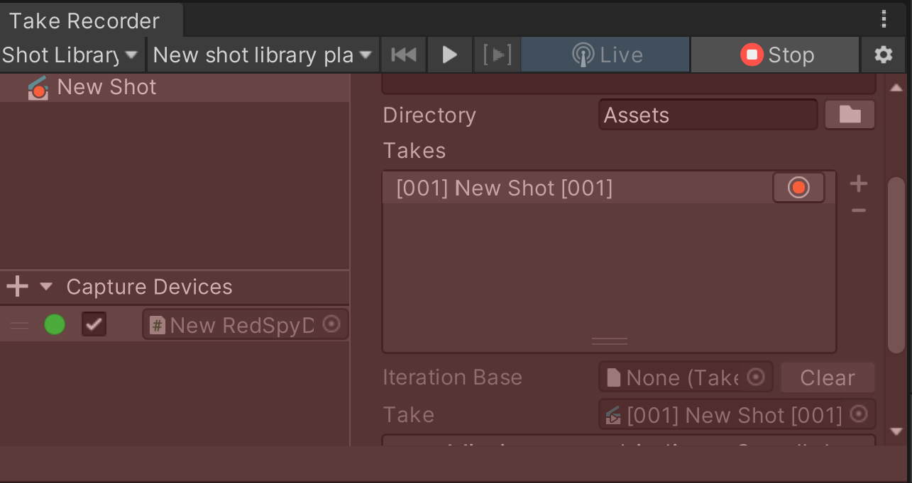

# チュートリアル

Stype RedSpy デバイスをセットアップし、Unity エディタに接続して Unity シーン内のカメラをコントロールします。

まず始めに、Live Capture パッケージのドキュメントに従って、[**ローカルネットワーク**](https://docs.unity3d.com/Packages/com.unity.live-capture@4.0/manual/connection-network.html)の設定を行ってください。

## Stype デバイスのセットアップ

### セットアップ前の確認事項

* Stype デバイスの電源が入っていること。
* Stype デバイスのファームウェアが最新バージョンにアップデートされていること。
* レンズのキャリブレーションが完了していること。

### RedSpy デバイスのセットアップ

1. **Protocol** を **StypeHF** に設定します。

2. **Zoom Polarity** を **Inverted** に設定します。

3. **Focus Polarity** を **Normal** に設定します。

4. **IP address** と **port number** をネットワーク接続が可能な値に設定します。

5. レンズキャリブレーションの設定で、**DOF mode** を **ON** に設定します。

## Stype デバイスを Unity エディタに接続する

[Connection ウィンドウ](https://docs.unity3d.com/Packages/com.unity.live-capture@4.0/manual/ref-window-connections.html)を使って、Stype デバイスと Unity エディタの接続を確立します：

1. Unity エディタのメニューから、**Window** > **Live Capture** > **Connections** を選択します。

2. 左上の **+**（プラス）ボタンを選択し、**Stype Connection** を選択します。

3. **Interface** で IP アドレスを選択し、**Port** を設定します。

4. Connection Status が **`Connected to Stype API.`** に変わっていることを確認します。

## キャプチャデバイスの作成

[Take Recorder ウィンドウ](https://docs.unity3d.com/Packages/com.unity.live-capture@4.0/manual/ref-window-take-recorder.html)を使用して、Stype デバイスから受信したデータを使用して Unity カメラを制御するため、キャプチャデバイスを作成します：

1. Unity エディタのメニューから、**Window** > **Live Capture** > **Take Recorder** を選択し、Capture Devices パネルの **+**（プラス）ボタンを選択し、**Stype > RedSpy** を選択します。

2. **Camera** プロパティを設定し、Stype デバイスで制御したいカメラをターゲットにします。

3. 映像と同期させるために、**Timecode Source** と **Framerate** に適切な値を設定します。

4. 警告が表示されたら **Fix** ボタンをクリックします。

5. **Live** ボタンをクリックします。

これで、Stype デバイスが Unity シーン内で対象の Unity カメラをコントロールするようになりました。

## カメラアニメーションの記録とエクスポート

Unity のカメラの動きやプロパティの変化を**アニメーションクリップ**として記録し、必要に応じて FBX ファイルとしてエクスポートすることで、Unity 以外の 3DCG ソフトで後処理を行うことができます（FBX ファイルを出力する場合は [FBX Exporter](https://docs.unity3d.com/Packages/com.unity.formats.fbx@latest) パッケージのインストールが必要になります）。

### 記録の開始

ショットライブラリからテイクを記録するには、[Take Recorder ウィンドウ](https://docs.unity3d.com/Packages/com.unity.live-capture@4.0/manual/ref-window-take-recorder.html) を使用します。

1. テイクレコーダーウィンドウの左上ペインで、**Shot Library** を選択します。

   

2. テイクを記録するショットを選択します。

3. **Create Shot Library** ボタンをクリックします。

4. **Record** ボタンをクリックします。

  

### FBX のエクスポート

記録したテイクを FBX ファイルにエクスポートするには、[FBX Exporter](https://docs.unity3d.com/Packages/com.unity.formats.fbx@latest) パッケージを使用します：

Timeline ウィンドウで、録音したテイクレコーダークリップを右クリックし、**Export Clip To FBX...** を選択します。

