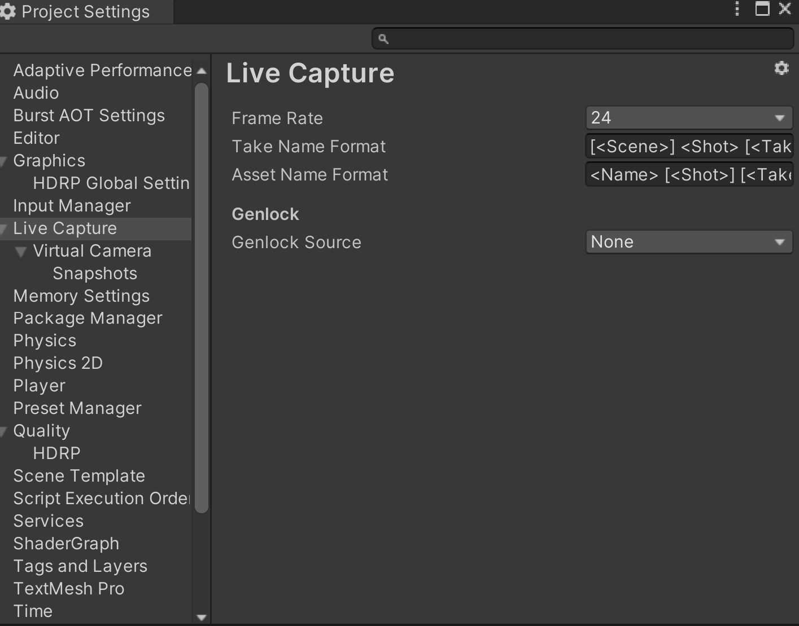

# トラブルシューティング

## 3DCG の座標がカメラに追従しない

- RedSpy デバイスに表示されているデータを確認する必要があります。[RedSpy の設定](getting-started.md#stype-デバイスのセットアップ)を参照してください。

- [Connections ウィンドウ](getting-started.md#stype-デバイスを-unity-エディタに接続する)で**IPアドレス**と**ポート**の値を確認します。

- 階層内のカメラが [RedSpy Device コンポーネント](getting-started.md#キャプチャデバイスの作成)に割り当てられていることを確認します。

## 画像と3DCGの座標がずれている

- RedSpy で正しいプロファイルが選択されているか確認してください。

- RedSpy を再起動してマーカーを再マッピングしてください。

## フレームレートが安定しない

- プロジェクト設定ウィンドウで Genlock が有効になっているか確認してください。

- RedSpy Device インスペクタウィンドウの **Frame Rate** の値を確認してください。

- Unity で使用していないウィンドウ、特にシーンビューとゲームビューを非表示にしてください。

- Wi-Fi を使用している場合は、ネットワークの安定性を確保するために有線接続を検討してください。

## フレームレートが遅い

- [Profiler ウィンドウ](https://docs.unity3d.com/Manual/ProfilerCPU.html)で CPU 使用率を確認し、パフォーマンス負荷がターゲットフレームレート以下であることを確認してください。

## 3DCG と映像の動きが合っていない

-  Live Capture の [Synchronization ウィンドウ](features.md#外部同期) でオフセットを設定してください。

