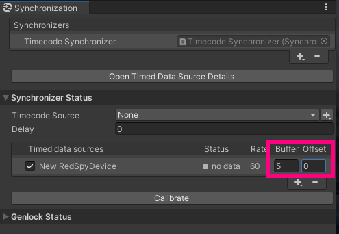

# Troubleshooting

## The positions of 3DCG don't follow the camera

- Check the data displayed on the RedSpy device. See the [RedSpy Settings](getting-started.md#set-up-your-stype-device).

- Check the **IP address** and **port** values in the [Connections Window](getting-started.md#connect-the-stype-device-to-the-unity-editor).

- Make sure the camera in the hierarchy is assigned to the [RedSpy Device Component](getting-started.md#create-a-capture-device).

## The positions of the image and 3DCG are out of alignment

- Check if the correct profile is selected on RedSpy.

- Restart RedSpy to remap the markers.

## The frame rate is not steady

- Check that Genlock is enabled in the Project Settings window.

- Check the **Frame Rate** value in the RedSpy Device inspector window.

- Hide unused windows in Unity, in particular Scene and Game views, which may slow down performance and cause performance spikes.

- If you are using Wi-Fi, consider a wired connection to ensure network stability.

## The frame rate is slow

- Check the CPU usage in the [Profiler window](https://docs.unity3d.com/Manual/ProfilerCPU.html) and ensure that the performance load is below the target framerate.

## The 3DCG and the video movements don't match

- Set the offset in the [Synchronization window](features.md#external-synchronization) of Live Capture.

