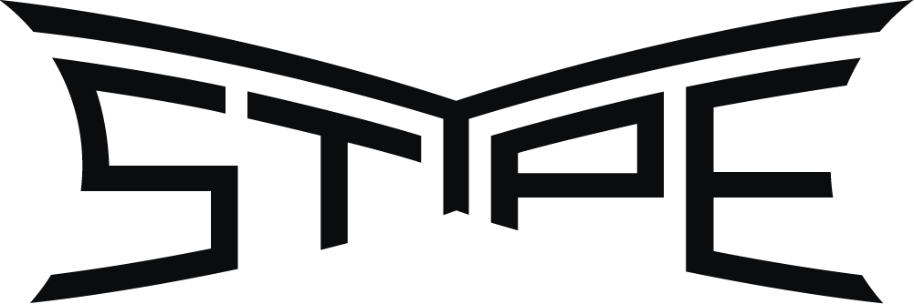

# Live Capture stYpe package

>[!NOTE]
> To use this package, you must install it separately and use a specific Unity Editor license. For detailed information about package requirements and installation instructions, refer to [Installation](Packages/com.unity.live-capture.stype/Documentation~/installation.md).

The stYpe package extends the [**Live Capture**](https://docs.unity3d.com/Packages/com.unity.live-capture@latest) package functionality to capturing data from camera tracking devices that support the **stYpe protocol**.

For instance, you can use the [RedSpy device](https://www.stype.tv/redspy) to manipulate the following Unity camera properties:

- **Movement**
- **Rotation**
- **Depth of field**
- **Field of view**
- **Lens distortion**
- **Lens Shift**
- **Sensor Size**

## In this documentation

 | Section | Description |
 |:---|:---|
 | [**Installation**](Packages/com.unity.live-capture.stype/Documentation~/installation.md) | Install the stYpe package and learn about the package requirements. |
 | [**Getting started**](Packages/com.unity.live-capture.stype/Documentation~/getting-started.md) | This section describes the steps to link the stYpe device with the Unity camera. |
 | [**Features**](Packages/com.unity.live-capture.stype/Documentation~/features.md) | Learn about the features and extended capabilities of the stYpe package. |
 | [**Troubleshooting**](Packages/com.unity.live-capture.stype/Documentation~/troubleshooting.md) | Get basic instructions to solve common issues you might experience when using the stYpe package. |

## Additional resources

* See the [official stYpe webpage](https://www.stype.tv) for more information about stYpe devices.

*Auto-generated on Wed Nov 22 03:27:42 UTC 2023*
